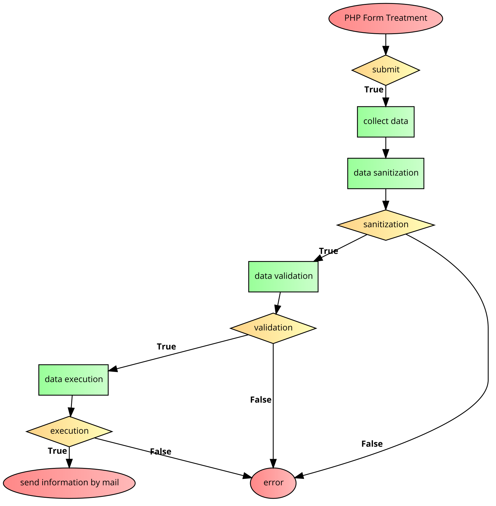
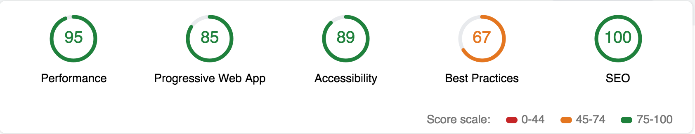
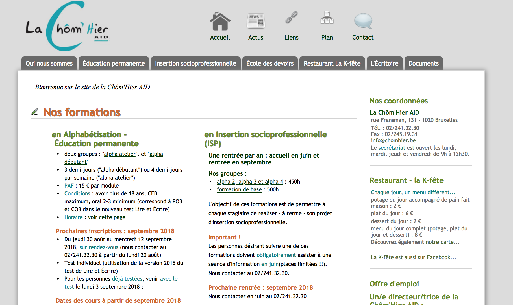
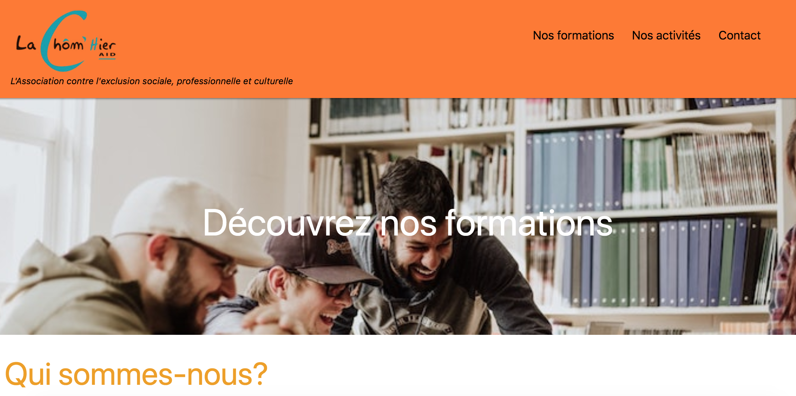

# multipage-website-in-php
___

# Projet "Chôm'hier AID", asbl pour l'insertion sociale

Visitez notre projet! (Lien à ajouter)
[Site initial](http://www.chomhier.be)

Visitez notre [Site rendu](https://lachomhieraid.herokuapp.com/index.php)

## Equipe

Formation **Becode.org**  
* [Charlotte Tusset (Johnson II)](https://github.com/CharlotteTusset)
* [Liliane Mamale (Lovelace)](https://github.com/lilama)

## Projet

* Multipage réalisé en HTML
* Framework CSS: [Materialize](https://materializecss.com/)
* Durée: 7 jours ouvrables (début: _30/07/2017_)
* **Objectif**: application des acquis PHP
* [UML simplifié](img/UML.svg)

### Consignes 

[Repo consignes](https://github.com/becodeorg/Johnson2/tree/master/projets/multipage-website-in-php#liste-des-objectifs-dapprentissage-oa)  

### Objectifs d'apprentissage (OA)

1. Agile (manipulation tableau kanban) + tenue quotidienne du planning du groupe.  
2. Être le capitaine du repo, qui gère les merge et les conflits
3. Rédaction d'un readme complet et professionnel
4. UX: branding
5. UX : contextual user entry errors display
6. UX : mentions GDPR et Copyright pour informer l'utilisateur de l'utilité de fournir les données
7. frontend : sélection et mise en place d'un framework CSS
8. backend : UML charting des différents scripts
9. backend : upload d'image
10. backend : édition d'un fichier txt en PHP
11. backend : utilisation d'un serveur SMTP
12. backend : éviter les injections SQL
13. devops : déploiement sur Heroku
14. backend : afficher les erreurs à proximité des champs concernés
15. frontend/backend : utiliser le lighthouse test pour améliorer son site et atteint un score de minimum 80 pour chaque critère.
16. frontend : Progressive Web App

## Screenshots

### Unified Modelling Language - UML 

### Lighthouse 

### Avant
  

### Après  

___

